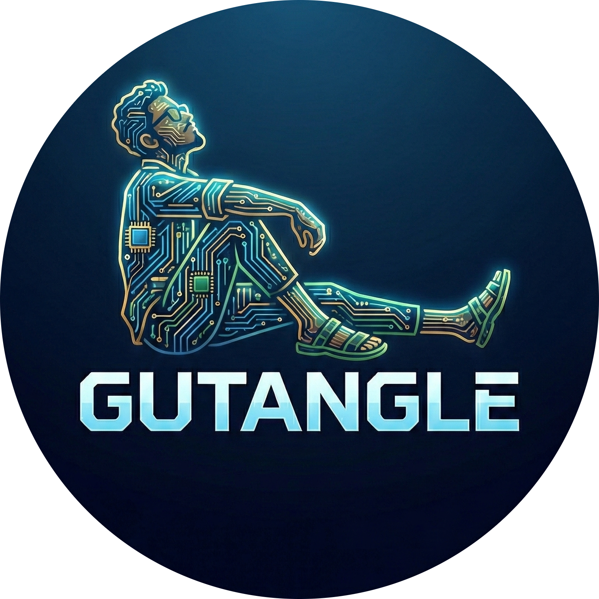

# 🧠 GutAngle: Clinical-Grade IoMT & Neurophysiology Platform

<p align="center">
  
</p>

**GutAngle** is a comprehensive biomedical monitoring platform designed to bridge the gap between brain activity (EEG) and spinal alignment (lumbar posture). This repository consolidates the core research project, the Android mobile application, and the modern landing page.

---

## 📁 Project Structure

This repository is organized into a unified, standalone structure for easy deployment:

### 1. Root Directory (Website & Platform)
- **index.html**: The standalone landing page (moved from `website/`).
- **css/**, **js/**, **img/**, **vdo/**: Core assets for the landing page.
- **application/**: The sophisticated dashboard interface for real-time monitoring.

### 2. [GutAngle_Project/](file:///home/manoj/Desktop/BME_App/GutAngle_Project/)
The architectural core of the research project.
- **android_app/**: A Kotlin-based hybrid mobile application that serves as the primary interface for wearable sensor data.
- **python/**: A Flask-powered backend engine for real-time signal processing and data management.

---

## 🚀 Key Features

- 📈 **Real-time Monitoring**: High-fidelity visualization of EEG (4 channels) and lumbar position metrics.
- 📱 **Mobile Integration**: Dedicated Android application with a "Tile" dashboard optimized for clinical use.
- 🔐 **User Onboarding**: Integrated biometric data collection for personalized health tracking and secure access.
- ♿ **Accessibility First**: High-contrast UI, multi-language support (9 languages), and ergonomic design for all age groups.
- 🛰️ **IoMT Connectivity**: Seamless Bluetooth integration for continuous data streaming from wearable devices.

---

## ⚙️ Getting Started

### 📱 Downloading the App
1. Visit the [Landing Page](index.html).
2. Click on the **Download APK** button.
3. Fill in your details (Name, Email, Phone, Age, and Address).
4. You will be redirected to the secure **Google Drive** folder to download the `GutAngle_Monitor.apk`.

### 🛠️ Local Development
- **Web Frontend**: Open `website/index.html` in any modern browser.
- **Backend Engine**: Navigate to `GutAngle_Project/python/` and run the Flask application:
  ```bash
  pip install -r requirements.txt
  python app.py
  ```

---

## 🤝 Research & Development
Developed by **Manoj (Biomedical Engineering)** as part of the GutAngle IoMT wearable research project, focusing on non-invasive bio-signal acquisition and ergonomic health monitoring.

**GutAngle Team** | *Engineering the Future of Health* 🧬
